#  Simulador de Tráfico - ICB0009 UF3 PR01

Este proyecto es una práctica del módulo **ICB0009 (UF3)** en el que se simula el tráfico de vehículos que recorren una carretera de 100 km con un puente de un solo carril.

Los vehículos son gestionados como procesos independientes (**clientes**) y se comunican con un **servidor principal**, que controla el estado de la carretera y el acceso al puente.

---

##  Estructura del proyecto

El proyecto se organiza en varios subproyectos dentro de un workspace en Visual Studio Code:

- `Servidor`: controla la lógica principal y gestiona múltiples clientes concurrentemente.
- `Cliente`: representa un vehículo que avanza por la carretera y se comunica con el servidor.
- `Vehiculo`: contiene la clase con los datos y estado de cada vehículo.
- `Carretera`: contiene la lista de vehículos y métodos para gestionar su estado.
- `NetworkStreamClass`: contiene métodos para la lectura y escritura con NetworkStream.

---

## Estructura Base y Control de Versiones

- Se ha configurado el repositorio en GitHub desde Visual Studio Code.
- Se ha añadido un archivo `.gitignore` adecuado para evitar subir carpetas de compilación (`bin/`, `obj/`).
- Se ha subido el archivo `Carretera-workspace.code-workspace` para mantener el entorno completo.
- Se ha creado la rama `developer` para trabajar progresivamente con control de versiones.

---

## EJERCICIO 1 - Conexión de clientes

---

##  Etapa 1 - Conexión servidor-cliente

###  Objetivo

Establecer una conexión básica entre un cliente (vehículo) y el servidor. El servidor debe quedar escuchando en un puerto y aceptar una única conexión. El cliente debe conectarse correctamente y mostrarse el estado por consola.

---

###  Explicación técnica

- El servidor se ha configurado para escuchar conexiones entrantes a través de `TcpListener` en el puerto 13000.
- El cliente utiliza `TcpClient` para conectarse al servidor utilizando `localhost`.
- Se han incluido mensajes por consola que permiten verificar en tiempo real si la conexión se ha realizado correctamente.
- El cliente incorpora un bloque `try-catch` para capturar posibles errores si el servidor no está disponible en ese momento.
- Ambos proyectos han sido probados de manera secuencial para verificar el éxito de la conexión.

---

###  Resultado de la prueba

- El **servidor** se inicia correctamente y queda esperando conexiones.
- El **cliente** se conecta sin problemas al servidor.
- Ambos programas muestran mensajes claros en consola que indican el estado de la conexión.
- Se ha confirmado visualmente que la conexión ha tenido éxito mediante pruebas funcionales y captura de pantalla.

---

###  Captura de pantalla

---

###  Comentario personal

Durante esta etapa he validado que el cliente y el servidor pueden comunicarse correctamente. He seguido la estructura proporcionada en clase y he utilizado mensajes claros para comprobar el flujo de la conexión. También he aplicado buenas prácticas como el uso de `try-catch` en el cliente para evitar errores imprevistos. Este es el punto de partida sobre el que se construirán las siguientes etapas.

---

##  Etapa 2 - Conexión múltiple: varios clientes concurrentes

###  Objetivo

Ampliar el servidor para que pueda aceptar **múltiples clientes simultáneamente**, gestionando cada conexión en un **hilo independiente**. De esta forma, el servidor no se bloquea al atender a un único cliente, sino que puede seguir aceptando nuevas conexiones mientras atiende las anteriores.

---

###  Explicación técnica

- He modificado el servidor para que ejecute un **bucle infinito `while (true)`** que acepta conexiones indefinidamente.
- Cada vez que un cliente se conecta, se lanza un nuevo **`Thread`** que gestiona esa conexión.
- Para cada cliente, se muestra un mensaje con el **ID del hilo** que lo atiende, lo que permite verificar que efectivamente se están creando múltiples hilos concurrentes.
- El servidor se mantiene activo todo el tiempo, esperando nuevos clientes sin cerrarse tras el primero.

---

###  Resultado de la prueba

- Se ha ejecutado el servidor y luego se han abierto varias instancias del cliente en paralelo.
- Todos los clientes han sido aceptados correctamente sin bloquear al servidor.
- En consola se observa que por cada cliente se imprime el mensaje de conexión y el hilo correspondiente lo atiende.

---

###  Captura de pantalla

---

###  Comentario personal

Durante esta etapa he aprendido a gestionar conexiones concurrentes mediante el uso de hilos (`Thread`). Al principio me llamó la atención que el orden de los `Thread ID` no siempre coincide con el orden de conexión, pero entendí que esto se debe a cómo .NET administra internamente los recursos de sistema.  
Este cambio sienta la base para permitir que múltiples vehículos circulen simultáneamente, lo cual será fundamental en las siguientes etapas.

---

## Etapa 3 - Asignación de ID único y dirección aleatoria

### Objetivo

Asignar un identificador único (ID) y una dirección aleatoria ("Norte" o "Sur") a cada cliente que se conecta al servidor. Este ID y dirección servirán como atributos básicos del vehículo en las próximas etapas.

---

### Explicación técnica

- He añadido un contador global estático (`contadorId`) en el servidor, que incrementa su valor con cada cliente nuevo.
- Utilizo un `lock` para asegurar que el acceso concurrente a este contador desde varios hilos sea seguro.
- Además, se genera aleatoriamente la dirección del vehículo, que puede ser `"Norte"` o `"Sur"`.
- Estos datos se muestran por consola para confirmar que cada cliente recibe su propio ID y dirección al conectarse.

---

### Resultado de la prueba

- Al iniciar el servidor y conectar varios clientes, se observa que:
  - Cada cliente recibe un ID único (1, 2, 3…).
  - Cada cliente recibe una dirección asignada de forma aleatoria.
  - Los mensajes aparecen correctamente identificados por hilo en la consola del servidor.
- Se ha verificado que, incluso al cerrar clientes tras la conexión, el servidor sigue asignando nuevos IDs correctamente a los siguientes.

---

### Captura de pantalla

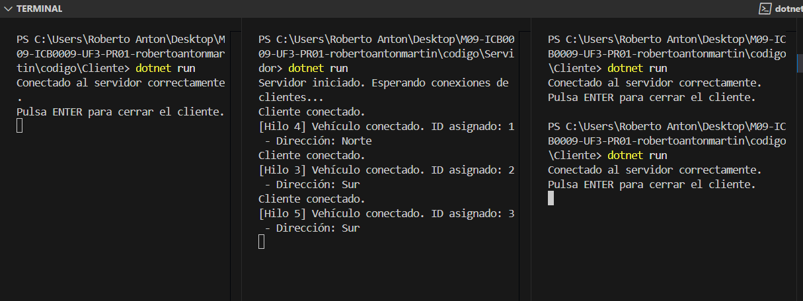

---

### Comentario personal

Esta etapa ha sido clave para comenzar a dar identidad a cada cliente conectado. El uso de `lock` para evitar condiciones de carrera al asignar el ID me ha permitido entender cómo se gestionan los recursos compartidos entre hilos. También he comprendido que el orden de llegada no tiene por qué coincidir con el número de hilo ni el ID final, lo que es lógico considerando el modelo de ejecución de hilos en .NET.

---

## Etapa 4 - Obtención del NetworkStream

### Objetivo

Obtener el objeto `NetworkStream` para cada cliente que se conecta al servidor. Este stream permitirá más adelante el envío y la recepción de datos de forma estructurada entre cliente y servidor.

---

### Explicación técnica

- Al recibir una conexión, he obtenido el `NetworkStream` directamente a partir del `TcpClient` utilizando `GetStream()`.
- Se muestra un mensaje en consola indicando que el `NetworkStream` ha sido obtenido correctamente.
- En esta etapa todavía no se realiza ningún envío o recepción de datos. Solo se prepara el canal de comunicación para las siguientes fases del proyecto.

---

### Resultado de la prueba

- El servidor acepta múltiples conexiones como en la etapa anterior.
- Por cada cliente conectado, se muestra en consola:
  - Su ID y dirección asignada.
  - Un mensaje adicional indicando que el `NetworkStream` se ha obtenido correctamente.
- Se ha verificado que no se produce ningún error al obtener el stream y que este se asigna correctamente a cada hilo.

---

### Captura de pantalla

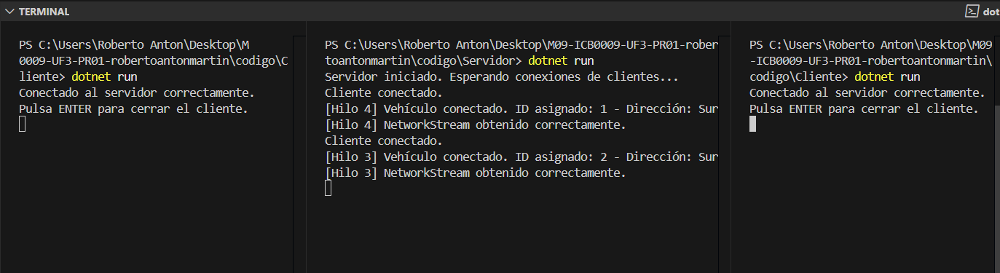

---

### Comentario personal

Esta etapa me ha servido para preparar la base de la comunicación bidireccional entre el cliente y el servidor. Aunque todavía no se intercambian datos, el hecho de obtener el `NetworkStream` correctamente me ha hecho entender cómo funciona este canal y cómo será utilizado en las etapas siguientes para leer y escribir mensajes entre ambas partes. También me ha permitido asegurar que cada hilo tiene su propio stream, lo que facilitará una gestión ordenada de cada cliente.

---

## Etapa 5 - Envío y lectura de mensaje con NetworkStream

### Objetivo

Utilizar el `NetworkStream` para enviar desde el servidor un mensaje de bienvenida a cada cliente conectado, y que el cliente lo lea correctamente utilizando los métodos definidos en la clase `NetworkStreamClass`.

---

### Explicación técnica

- He utilizado el método `EscribirMensajeNetworkStream()` desde el servidor para enviar al cliente un mensaje de bienvenida personalizado con su ID y dirección.
- En el cliente, se ha utilizado `LeerMensajeNetworkStream()` para recibir el mensaje enviado por el servidor y mostrarlo por consola.
- Estos métodos están definidos en la clase `NetworkStreamClass`, la cual trabaja con arrays de bytes codificados en Unicode y permite intercambiar texto de forma segura.

---

### Resultado de la prueba

- El servidor envía correctamente el mensaje al cliente justo después de que este se conecta.
- El cliente recibe el mensaje y lo muestra en consola de manera inmediata.
- Ambos lados muestran trazas claras del envío y la recepción, permitiendo confirmar el correcto funcionamiento del canal `NetworkStream`.

---

### Captura de pantalla

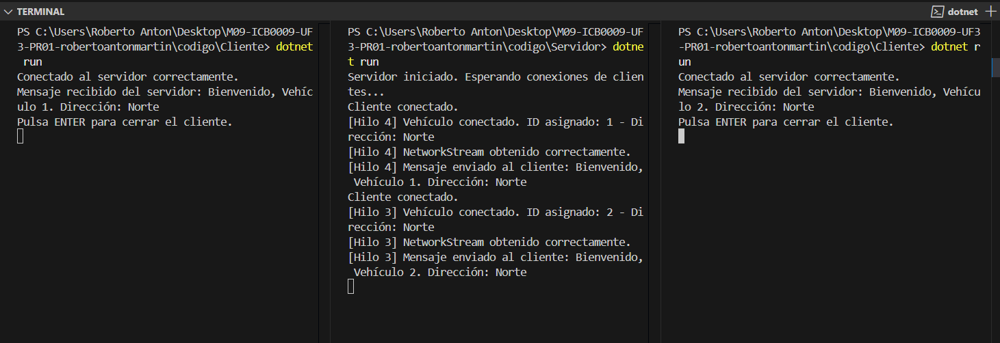

---

### Comentario personal

Esta etapa ha sido un punto de inflexión porque me ha permitido implementar la primera comunicación real entre el servidor y el cliente. Gracias a los métodos ya preparados en la clase `NetworkStreamClass`, ha sido más fácil comprender cómo se transmiten datos a través de la red en forma de bytes y cómo leerlos correctamente. He validado que cada hilo tiene su propio `NetworkStream` y que el mensaje enviado llega de forma íntegra al cliente. Esto será clave en las etapas siguientes cuando trabajemos con objetos completos como `Vehiculo` y `Carretera`.

---

## Etapa 6 - Protocolo completo: INICIO, ID y envío de Vehículo

### Objetivo

Implementar un protocolo básico de comunicación cliente-servidor que incluya los siguientes pasos:
1. El cliente envía un mensaje inicial `'INICIO'`.
2. El servidor responde con el ID asignado y la dirección.
3. El cliente confirma la recepción del ID.
4. El cliente crea y envía un objeto `Vehiculo` con los datos correspondientes.

Esta secuencia simula el proceso de inicialización de un vehículo antes de incorporarse a la carretera.

---

### Explicación técnica

- El **cliente** comienza enviando el mensaje `'INICIO'` al servidor utilizando `EscribirMensajeNetworkStream()`.
- El **servidor** recibe este mensaje, lo muestra por consola y asigna un ID y dirección al nuevo cliente.
- El servidor **envía este ID al cliente** como texto para su identificación.
- El cliente **recibe el ID**, lo analiza desde el mensaje, y lo **envía de vuelta como confirmación**.
- A continuación, el cliente **crea un objeto `Vehiculo`** real con ese ID y dirección.
- Finalmente, el cliente envía el objeto completo al servidor utilizando `EscribirDatosVehiculoNS()`.

En el lado del servidor, el objeto se recibe con `LeerDatosVehiculoNS()` y se deserializa automáticamente utilizando XML. El servidor muestra por consola todos los datos recibidos para verificar que la comunicación se ha realizado correctamente.

---

### Resultado de la prueba

- En consola del servidor se observa:
  - El mensaje `'INICIO'` recibido correctamente.
  - La asignación de un ID y una dirección.
  - El ID enviado al cliente.
  - La confirmación del ID desde el cliente.
  - La recepción del objeto `Vehiculo` completo y sus atributos mostrados por consola.
- En consola del cliente se ve:
  - Confirmación de conexión.
  - Mensaje `'INICIO'` enviado al servidor.
  - ID recibido desde el servidor.
  - ID confirmado al servidor.
  - Creación del objeto `Vehiculo` con ID y dirección reales.
  - Vehículo enviado al servidor correctamente.

---

### Captura de pantalla

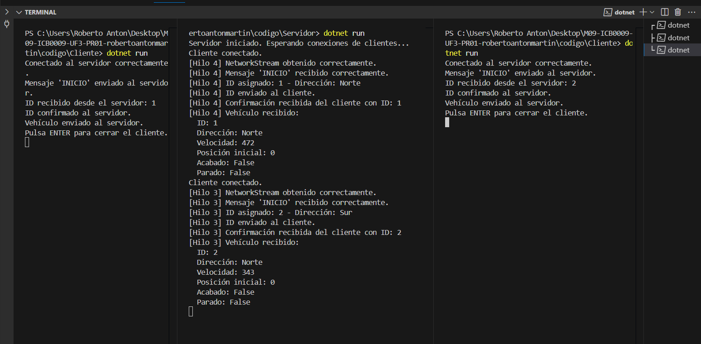

---

### Comentario personal

Esta etapa ha sido una de las más completas y realistas hasta el momento. He implementado un protocolo de comunicación entre cliente y servidor que simula de forma fiel la inicialización de un vehículo en una red distribuida. Me ha ayudado a comprender mejor el flujo de intercambio de datos en entornos con múltiples hilos y cómo estructurar la lógica para que los datos viajen de forma segura y estructurada. Gracias a la serialización XML, puedo enviar y recibir objetos completos de tipo `Vehiculo` sin tener que preocuparme por la conversión manual de propiedades.

---

## Etapa 7 - Gestión de clientes conectados

### Objetivo

Mantener una lista en el servidor con todos los clientes que se conectan, incluyendo su `ID` y su `NetworkStream`, para permitir futuras comunicaciones con ellos. Esta etapa establece la base para simular una carretera con varios vehículos activos que pueden ser consultados o gestionados desde el servidor.

---

### Explicación técnica

- He creado una clase `ClienteConectado` para almacenar el `ID` y el `NetworkStream` de cada cliente.
- En el servidor, he declarado una lista global `listaClientes` protegida con un `lock` para evitar conflictos en entornos multihilo.
- En el método `GestionarCliente()`, después de asignar el `ID` y obtener el `NetworkStream`, añado el nuevo cliente a la lista compartida.
- Cada vez que un nuevo cliente se conecta, se registra en esta lista con un mensaje en consola indicando el número total de conectados.
- **Nota importante:** en esta etapa, los clientes no se eliminan automáticamente de la lista al cerrar su conexión, ya que aún no hemos implementado un mecanismo de seguimiento del estado en tiempo real. La lista refleja los vehículos activos durante la sesión de trabajo.

---

### Resultado de la prueba

- El servidor muestra por consola:
  - La asignación de ID y dirección.
  - La adición del cliente a la lista.
  - El número total de clientes conectados actualizado correctamente.
- La lista `listaClientes` se va llenando conforme nuevos clientes se conectan, lo que me permite disponer de un registro completo.
- No se eliminan de forma inmediata tras la desconexión, ya que todavía no se gestiona un control de estado en tiempo real.

---

### Captura de pantalla

---

### Comentario personal

EEsta etapa ha sido una de las más completas y realistas hasta el momento. He implementado un protocolo de comunicación entre cliente y servidor que simula de forma fiel la inicialización de un vehículo en una red distribuida. Me ha ayudado a comprender mejor el flujo de intercambio de datos en entornos con múltiples hilos y cómo estructurar la lógica para que los datos viajen de forma segura y estructurada.

En esta fase también he comenzado a gestionar una lista de clientes conectados, lo que me permitirá mantener el control de qué vehículos están activos en la simulación. Aunque por ahora no elimino a los clientes automáticamente tras su desconexión, esta lógica se añadirá más adelante, cuando el servidor deba mantener en tiempo real el estado de los vehículos.

---

# Ejercicio 2 – Simulación de carretera con objetos `Carretera`

A partir de esta sección comienza el segundo ejercicio de la práctica, que se centra en simular la carretera como un conjunto de vehículos y gestionar dicha información entre cliente y servidor utilizando objetos complejos. En esta primera etapa, nos enfocamos únicamente en **implementar la lógica de serialización y deserialización** para los objetos `Carretera`, sin necesidad de ejecutar pruebas funcionales todavía.

---

## Etapa 1 – Programación de métodos NetworkStreamClass para Carretera

### Objetivo

Implementar los métodos necesarios en la clase `NetworkStreamClass` que permitan el envío y la recepción de objetos `Carretera` a través de un `NetworkStream`. Esta funcionalidad será clave para permitir que el servidor y el cliente puedan intercambiar información sobre el estado de todos los vehículos que circulan por la carretera.

---

### Explicación técnica

- He reutilizado los métodos ya definidos en la clase `Carretera` para serializar (`CarreteraABytes()`) y deserializar (`BytesACarretera()`).
- En `NetworkStreamClass` he añadido dos métodos:
  - `EscribirDatosCarreteraNS(NetworkStream, Carretera)`: convierte el objeto en un array de bytes y lo escribe en el stream.
  - `LeerDatosCarreteraNS(NetworkStream)`: reconstruye el objeto `Carretera` leyendo los bytes del stream.
- La estructura sigue el mismo patrón ya utilizado para los objetos `Vehiculo`, por lo que he podido reutilizar conceptos previos.
- He aumentado el tamaño del buffer para asegurar la recepción de todos los datos del objeto `Carretera`, que puede contener varios vehículos.

---

### Código implicado

- Archivo modificado: `NetworkStreamClass.cs`
- Métodos añadidos:
  - `EscribirDatosCarreteraNS(NetworkStream, Carretera)`
  - `LeerDatosCarreteraNS(NetworkStream)`

---

### Comentario personal

En esta etapa no se realiza ninguna ejecución funcional, pero sí ha sido esencial implementar correctamente la serialización de objetos complejos como `Carretera`, que contienen listas de vehículos. Me ha permitido comprender cómo empaquetar estructuras más grandes para transmitirlas entre procesos de forma eficiente. Esta etapa sienta las bases para las siguientes, donde comenzaremos a trabajar con lógica de avance, simulación de posiciones y actualizaciones entre el cliente y el servidor.

---

## Etapa 2 – Envío del objeto Carretera desde el servidor al cliente

### Objetivo

Ampliar la simulación para que el servidor cree un objeto `Carretera`, añada el `Vehiculo` recibido del cliente y lo devuelva como respuesta. El cliente debe deserializar este objeto y mostrar en consola la información contenida en él. Esta etapa permite comprobar que el intercambio de objetos complejos (listas de vehículos) funciona correctamente.

---

### Explicación técnica

- Tras recibir el objeto `Vehiculo`, el **servidor** crea un objeto `Carretera` y utiliza el método `AñadirVehiculo()` para incluir el vehículo recibido.
- Luego, el servidor envía este objeto `Carretera` al cliente utilizando el método `EscribirDatosCarreteraNS()` desde la clase `NetworkStreamClass`.
- En el **cliente**, el objeto `Carretera` es recibido con `LeerDatosCarreteraNS()` y se deserializa automáticamente.
- Finalmente, el cliente muestra en consola la **posición de los vehículos en la carretera** usando el método `MostrarBicicletas()`.
- La comunicación sigue utilizando `NetworkStream`, y los objetos viajan como XML serializado, exactamente como en etapas anteriores.

---

### Resultado de la prueba

- El **servidor**:
  - Recibe el vehículo.
  - Lo añade a una nueva instancia de `Carretera`.
  - Envía el objeto completo al cliente.
  - Muestra en consola que ha enviado correctamente la carretera con un vehículo.

- El **cliente**:
  - Recibe correctamente el objeto `Carretera`.
  - Muestra por consola la posición de los vehículos, que en esta etapa es siempre `0` (posición inicial).

---

### Captura de pantalla

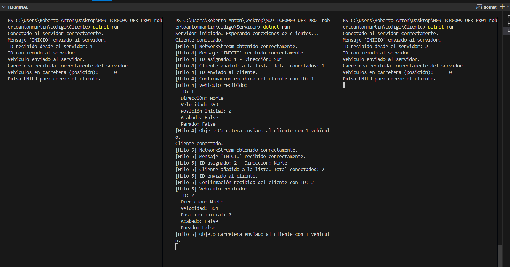

---

### Comentario personal

Nota Importante: En este ejercicio 2 he tenido que modificar la clase NetworkStreamClass debido a que antes de realizar el commit accidentamente manipule el fichero y tenía  mal posicionada una llave, he tenido que corregirlo. (En la etapa 1 del ejercicio 2 como no tenía que probar la ejecución del programa no me había percatado del error)

Esta etapa me ha permitido consolidar el uso de objetos más complejos como `Carretera`, que agrupan varios `Vehiculo`. Al simular el envío y recepción de este tipo de estructuras, se demuestra que el proyecto está preparado para manejar una lógica de simulación más rica en etapas futuras. Además, comprobar por consola las posiciones en la carretera me da una visión clara de que el sistema está funcionando como debe. Aunque de momento solo se añade un vehículo por carretera, esto servirá como base para enviar estados más completos de la simulación en tiempo real.

---

## Etapa 3 – Simulación continua de avance de los vehículos

### Objetivo

Simular de forma realista el avance de los vehículos en la carretera, enviando al servidor actualizaciones periódicas de su estado. El servidor debe actualizar su estado global de la carretera y devolverlo al cliente. Esta etapa permite observar cómo se va construyendo una simulación distribuida de tráfico, en la que múltiples vehículos circulan y comparten la carretera en tiempo real.

---

### Explicación técnica

- En el **cliente**, se ha programado un bucle donde el objeto `Vehiculo` avanza de 10 en 10 km hasta alcanzar los 100 km.
- En cada iteración:
  - Se actualiza la posición del vehículo.
  - Se marca como `Acabado = true` al llegar al destino.
  - Se envía el objeto `Vehiculo` al servidor.
  - Se recibe desde el servidor un objeto `Carretera` actualizado.
  - Se imprime la lista de posiciones de todos los vehículos activos en ese momento.
- En el **servidor**:
  - Se ha creado una **carretera global** (`carreteraGlobal`) que almacena todos los vehículos de todos los clientes conectados.
  - Cuando recibe un `Vehiculo`, lo actualiza con el método `ActualizarVehiculo()` (que añade el vehículo si es nuevo o modifica su estado si ya existe).
  - Luego devuelve al cliente el estado completo de la carretera.
- Se han utilizado `lock` para asegurar el acceso concurrente a la carretera compartida por múltiples hilos.

---

### Resultado de la prueba

- El sistema ha sido probado con **dos clientes en paralelo**, cada uno avanzando su vehículo y actualizando su estado en la carretera.
- En consola del cliente se observa:
  - La posición actual del vehículo en cada paso.
  - El listado actualizado de posiciones de todos los vehículos en carretera.
  - La finalización del trayecto cuando el vehículo llega a los 100 km.
- En consola del servidor se observa:
  - Los datos recibidos de cada vehículo.
  - La confirmación de llegada al destino para cada uno.

---

### Captura de pantalla

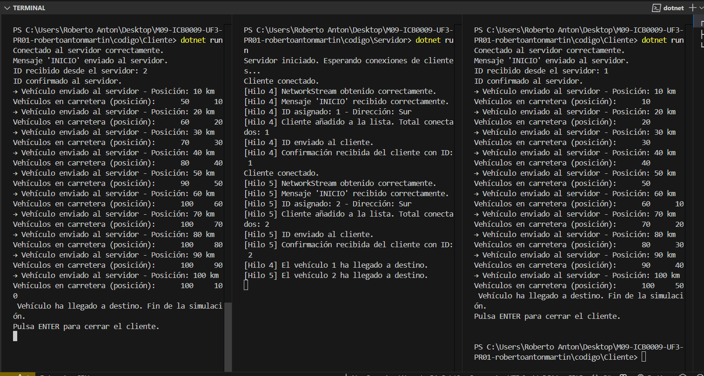

---

### Comentario personal

Esta ha sido la etapa que más me ha acercado a una simulación real. He visto cómo, cliente a cliente, se va construyendo una visión compartida del estado de la carretera. Me ha permitido entender cómo aplicar técnicas de concurrencia (`lock`), cómo mantener estructuras compartidas seguras, y cómo simular el tiempo real mediante bucles y `Thread.Sleep()`.

Al principio usaba la propiedad `Velocidad`, pero en esta versión decidí avanzar en bloques fijos de 10 km para asegurar control visual de cada paso. En versiones futuras puedo vincular `Sleep()` o el paso de avance a la velocidad real del vehículo.

El sistema es ahora **concurrente, distribuido y progresivo**, y refleja de forma clara cómo múltiples clientes pueden trabajar sobre una simulación compartida.

---

### 🔧 **Ampliación: Implementación real de la velocidad del vehículo**

Conforme a las instrucciones del enunciado del ejercicio, se ha implementado el uso del atributo `Velocidad` del vehículo para controlar el **tiempo entre cada avance**. Este valor (aleatorio) se genera al construir el objeto `Vehiculo` y se aplica directamente al `Thread.Sleep(...)` del cliente.

Además, se imprime por consola la velocidad generada para facilitar la interpretación visual durante las pruebas.

---

### Nueva Captura de pantalla

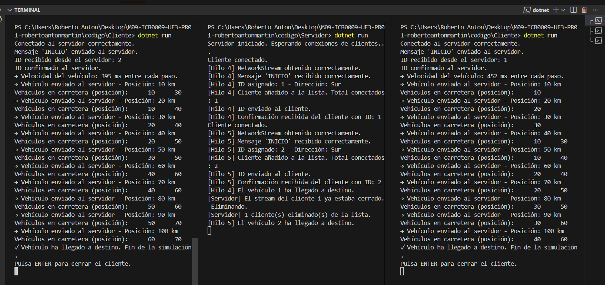

---

### Comentario final de etapa

Ahora cada vehículo avanza de forma independiente no solo en posición, sino también en **tiempo de espera**. La carretera es compartida, el estado es sincronizado y el comportamiento ya no es uniforme: **cada vehículo tiene su propio ritmo**, como en la vida real.

---

## Etapa 4 – Envío del estado global de la carretera a todos los clientes conectados

### Objetivo

Actualizar el sistema para que el **servidor no solo devuelva la carretera al cliente que envió el vehículo**, sino que **envíe el estado global de la carretera a todos los clientes conectados**. Esto permite que todos los vehículos visualicen el estado compartido de la simulación en tiempo real.

---

### Explicación técnica

- Se ha creado el método `EnviarCarreteraATodos()` en el servidor.
- Este método recorre la lista `listaClientes` y envía la carretera actualizada a cada uno utilizando `NetworkStreamClass.EscribirDatosCarreteraNS()`.
- Para evitar errores, se han añadido **bloques `try-catch`**:
  - `IOException` para detectar desconexiones repentinas.
  - `ObjectDisposedException` para detectar streams cerrados.
- Si un cliente genera una excepción al enviarle la carretera, se añade a una **lista temporal de desconectados**, que luego se elimina de la lista de clientes conectados.
- Se protege toda la operación con `lock (lockLista)` para evitar problemas de concurrencia.

---

### Resultado de la prueba

- El sistema ha sido probado con **dos clientes activos**.
- Ambos clientes reciben en tiempo real el estado de la carretera, incluyendo su propia posición y la del otro vehículo.
- Si un cliente llega a destino y se cierra su conexión:
  - El servidor detecta la excepción y elimina al cliente de forma segura.
  - El resto de clientes sigue funcionando sin errores.
- Se elimina correctamente el cliente desconectado y se muestra un mensaje en consola confirmando la limpieza de la lista.

---

### Captura de pantalla

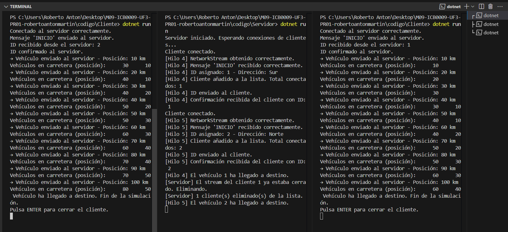

---

### Comentario personal

Esta etapa ha sido clave para alcanzar el comportamiento realista que exige una simulación distribuida: **todos los clientes deben tener una visión sincronizada del entorno**.  
Al principio se producía un error `ObjectDisposedException` cuando el servidor intentaba escribir en un cliente ya finalizado.  
He solucionado este error implementando una lógica para detectar y eliminar automáticamente a los clientes desconectados, evitando que el sistema falle.

Me siento especialmente satisfecho porque he conseguido que el servidor funcione de forma **robusta y tolerante a fallos**, lo cual es fundamental en cualquier arquitectura multicliente.  
La simulación es ahora completamente coherente entre todos los clientes activos.

---
## Etapa 5 – Recepción en hilo secundario del estado de la carretera

### Objetivo

Separar la lógica de avance del vehículo y la lógica de recepción de actualizaciones para evitar bloqueos. El cliente ahora recibe el estado global de la carretera en **tiempo real y en paralelo**, usando un hilo secundario que escucha continuamente los mensajes del servidor.

---

### Explicación técnica

- Se ha creado un **nuevo hilo secundario** en el cliente:
  - Escucha el `NetworkStream`.
  - Recibe objetos `Carretera` del servidor en tiempo real.
  - Ordena los vehículos por posición para mostrar una visión clara y ordenada.
  - Muestra la actualización por consola en todo momento.

- Este hilo corre en paralelo al hilo principal del cliente, que se encarga de avanzar el vehículo, enviarlo al servidor y dormir según su velocidad.

- Gracias a esta separación, la simulación se vuelve **más realista y fluida**, permitiendo que cada cliente **vea constantemente los movimientos de los demás** sin tener que esperar su propio avance.

---

### Resultado de la prueba

- Cada cliente tiene su propio hilo receptor que muestra la evolución de la carretera aunque no haya avanzado todavía.
- Al finalizar el trayecto, el vehículo deja de enviar información pero puede seguir recibiendo actualizaciones hasta que se cierre la conexión.
- La información impresa en consola es **coherente y cronológicamente clara**, permitiendo visualizar perfectamente la posición de cada vehículo en cada instante.

---

### Capturas de pantalla 

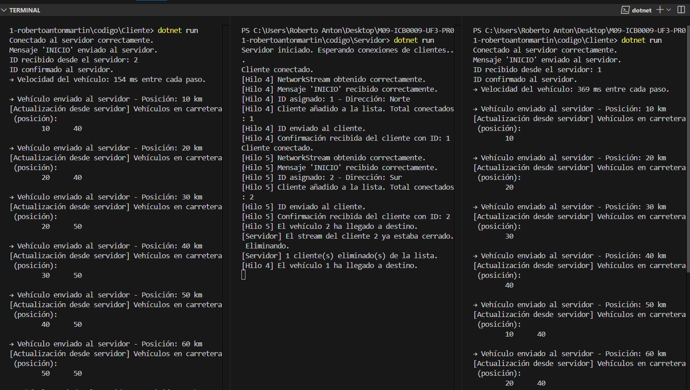

---

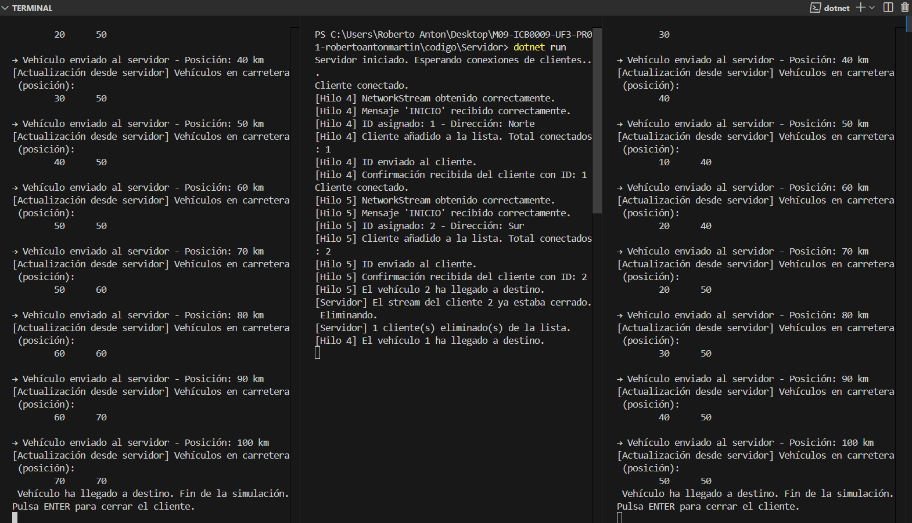

---

### Comentario personal

Esta etapa ha supuesto un gran paso hacia una simulación totalmente **asíncrona y no bloqueante**.  
Implementar el hilo receptor en segundo plano ha mejorado notablemente la experiencia visual, ya que permite ver cómo se mueve la carretera en tiempo real sin interferir con el avance del propio vehículo.

Además, el código se ha vuelto más modular y robusto. Me ha servido para practicar la gestión de hilos concurrentes con `Thread` y comprobar cómo afecta la arquitectura cliente-servidor a la sincronización de datos.

---
###  **Ampliación: Lógica de avance según dirección "Norte" o "Sur"** (Pertenece etapa 3)

En esta fase he incorporado una funcionalidad crucial para que la simulación sea **realista y bidireccional**: la gestión del avance de los vehículos en función de su dirección (`Norte` o `Sur`).

####  ¿Qué se ha añadido?
- Ahora, cada vehículo **se inicializa con una dirección aleatoria** ("Norte" o "Sur").
- Si un vehículo va al **Norte**, comienza en el **km 0** y avanza hacia el **km 100**.
- Si va al **Sur**, comienza en el **km 100** y retrocede hasta el **km 0**.
- El bucle de avance se ha adaptado para que cada cliente siga la lógica correcta según su dirección.

####  ¿Cómo se refleja en consola?
- Se visualiza en todo momento:
  - El `ID`, la `Dirección` y la `Posición` actual de cada vehículo.
  - La sincronización con el resto de clientes conectados.
- Se observa cómo **los vehículos pueden cruzarse** en posiciones intermedias (por ejemplo, ambos pasan por el km 40 o 60), lo cual es completamente coherente si no se ha implementado colisión o control de paso en puentes.

---

###  Nueva Captura de pantalla

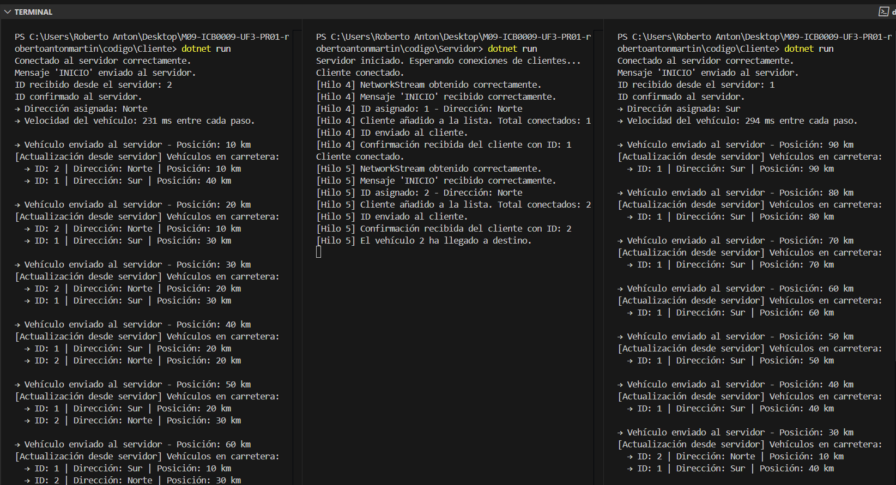

---

###  Comentario final tras implementación de dirección

Ahora los vehículos **no solo se mueven de forma concurrente y a ritmos distintos**, sino que **cada uno tiene su origen y destino según su dirección**, lo cual es lo que cabría esperar en un sistema de simulación vial distribuido.

Además, esta modificación me ha permitido entender cómo se puede adaptar un sistema cliente-servidor para representar flujos de datos diferenciados, en este caso reflejados en el sentido de circulación de cada vehículo. El hecho de que dos vehículos lleguen a cruzarse en consola demuestra que **ambos están bien sincronizados y avanzan según su propia lógica de dirección**.

---

# Ejercicio 3 – Control de tráfico en el puente

En esta fase del proyecto, el objetivo ha sido implementar un sistema de control que permita que solo un vehículo cruce el **puente de un único carril** a la vez. Además, se debe impedir que vehículos en dirección opuesta intenten cruzar mientras el puente esté ocupado.

---

## Objetivo

- Permitir que un solo vehículo esté cruzando el puente en cualquier momento.
- Bloquear el acceso al puente a los vehículos mientras otro vehículo esté cruzando.
- Asegurar que los vehículos esperan correctamente su turno para cruzar.
- Mantener la actualización en tiempo real de la carretera para todos los clientes.

---

## Explicación técnica

- Se ha añadido en el **servidor** una variable global `vehiculoEnPuente`, protegida con `lock`.
- Cuando un vehículo alcanza una posición crítica (60 km en Norte, o 40 km en Sur), envía una solicitud para entrar al puente.
- El servidor responde:
  - Si no hay ningún vehículo en el puente (`vehiculoEnPuente == null`), autoriza el acceso.
  - Si el puente está ocupado (`vehiculoEnPuente != null`), obliga al cliente a **esperar** hasta que quede libre.
- Cuando un vehículo termina de cruzar, el servidor libera el puente (`vehiculoEnPuente = null`) y notifica a los vehículos esperando que pueden reintentar cruzar.
- Esta lógica se ha implementado **en el servidor**, centralizando el control de acceso al puente para evitar inconsistencias.

---

## Resultado de la prueba

- **Cliente 1** y **Cliente 2** inician su recorrido en paralelo.
- Cuando el **Cliente 1** llega al puente, solicita acceso y se le permite cruzar.
- Mientras el **Cliente 1** cruza, el **Cliente 2** llega al puente y detecta que el puente está ocupado, entrando en estado de **espera**.
- Una vez que el **Cliente 1** ha terminado de cruzar, el **Cliente 2** recibe la notificación y puede iniciar su cruce.
- El avance y cruce de ambos vehículos se observa correctamente en la consola de ambos clientes y del servidor.

---

## Capturas de pantalla

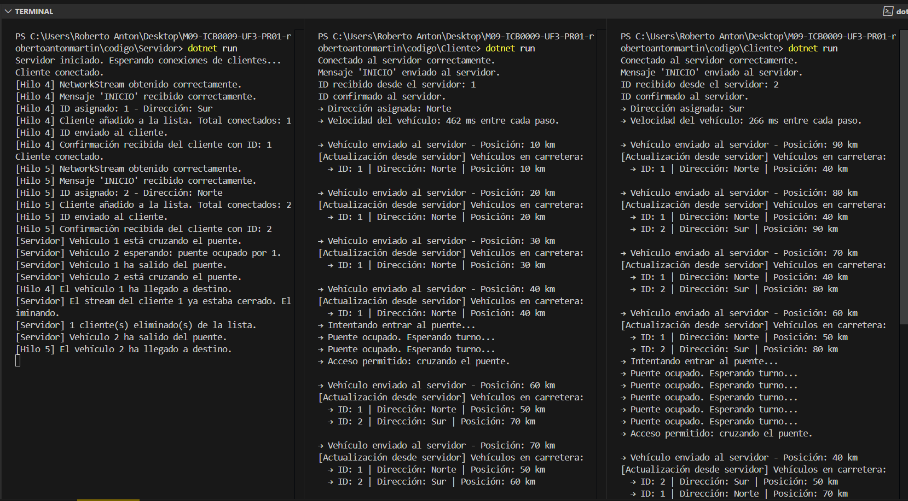

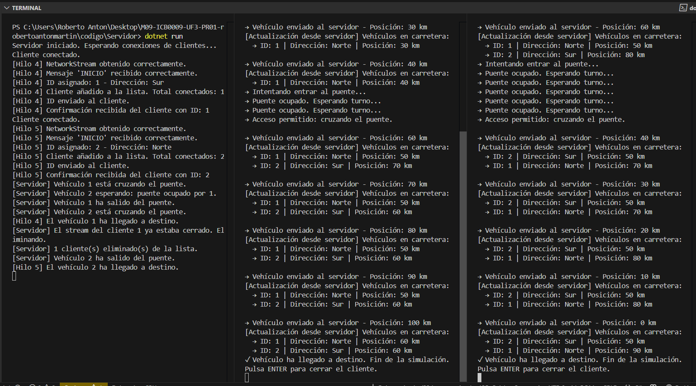

---

## Comentario personal

Este ejercicio ha sido **clave** para culminar la simulación de tráfico de forma **realista** y **coherente**.

La implementación del control de acceso al puente me ha permitido comprender cómo gestionar **recursos compartidos críticos** en un sistema distribuido, utilizando mecanismos de sincronización (`lock`) y control de estados en el servidor.

También he observado en la práctica la importancia de diseñar bien la lógica de espera y notificación para evitar bloqueos o accesos simultáneos no deseados.

Gracias a esta última fase, el sistema ahora simula de manera precisa cómo varios vehículos interactúan de forma **concurrente, sincronizada y controlada** en un entorno compartido.

---

##  Alumno

- **Nombre completo:** Roberto Antón Martín  
- **UF:** UF3 – Simulación de tráfico con sockets y servicios  
- **Centro:** La Salle  
