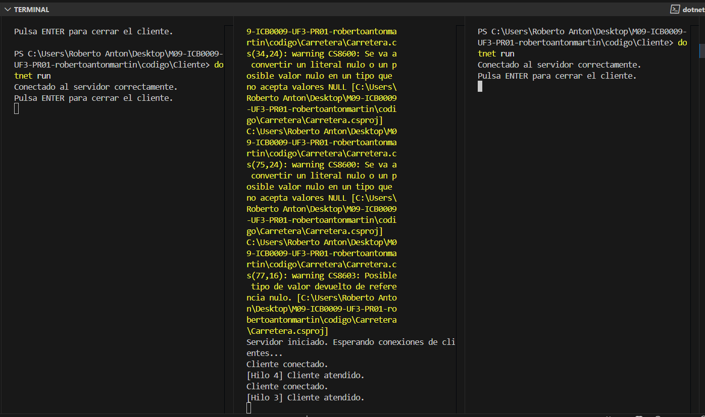

#  Simulador de Tráfico - ICB0009 UF3 PR01

Este proyecto es una práctica del módulo **ICB0009 (UF3)** en el que se simula el tráfico de vehículos que recorren una carretera de 100 km con un puente de un solo carril.

Los vehículos son gestionados como procesos independientes (**clientes**) y se comunican con un **servidor principal**, que controla el estado de la carretera y el acceso al puente.

---

##  Estructura del proyecto

El proyecto se organiza en varios subproyectos dentro de un workspace en Visual Studio Code:

- `Servidor`: controla la lógica principal y gestiona múltiples clientes concurrentemente.
- `Cliente`: representa un vehículo que avanza por la carretera y se comunica con el servidor.
- `Vehiculo`: contiene la clase con los datos y estado de cada vehículo.
- `Carretera`: contiene la lista de vehículos y métodos para gestionar su estado.
- `NetworkStreamClass`: contiene métodos para la lectura y escritura con NetworkStream.

---

## Estructura Base y Control de Versiones

- Se ha configurado el repositorio en GitHub desde Visual Studio Code.
- Se ha añadido un archivo `.gitignore` adecuado para evitar subir carpetas de compilación (`bin/`, `obj/`).
- Se ha subido el archivo `Carretera-workspace.code-workspace` para mantener el entorno completo.
- Se ha creado la rama `developer` para trabajar progresivamente con control de versiones.

---

##  Etapa 1 - Conexión servidor-cliente

###  Objetivo

Establecer una conexión básica entre un cliente (vehículo) y el servidor. El servidor debe quedar escuchando en un puerto y aceptar una única conexión. El cliente debe conectarse correctamente y mostrarse el estado por consola.

---

###  Explicación técnica

- El servidor se ha configurado para escuchar conexiones entrantes a través de `TcpListener` en el puerto 13000.
- El cliente utiliza `TcpClient` para conectarse al servidor utilizando `localhost`.
- Se han incluido mensajes por consola que permiten verificar en tiempo real si la conexión se ha realizado correctamente.
- El cliente incorpora un bloque `try-catch` para capturar posibles errores si el servidor no está disponible en ese momento.
- Ambos proyectos han sido probados de manera secuencial para verificar el éxito de la conexión.

---

###  Resultado de la prueba

- El **servidor** se inicia correctamente y queda esperando conexiones.
- El **cliente** se conecta sin problemas al servidor.
- Ambos programas muestran mensajes claros en consola que indican el estado de la conexión.
- Se ha confirmado visualmente que la conexión ha tenido éxito mediante pruebas funcionales y captura de pantalla.

---

###  Captura de pantalla

---

###  Comentario personal

Durante esta etapa he validado que el cliente y el servidor pueden comunicarse correctamente. He seguido la estructura proporcionada en clase y he utilizado mensajes claros para comprobar el flujo de la conexión. También he aplicado buenas prácticas como el uso de `try-catch` en el cliente para evitar errores imprevistos. Este es el punto de partida sobre el que se construirán las siguientes etapas.

---

##  Etapa 2 - Conexión múltiple: varios clientes concurrentes

###  Objetivo

Ampliar el servidor para que pueda aceptar **múltiples clientes simultáneamente**, gestionando cada conexión en un **hilo independiente**. De esta forma, el servidor no se bloquea al atender a un único cliente, sino que puede seguir aceptando nuevas conexiones mientras atiende las anteriores.

---

###  Explicación técnica

- He modificado el servidor para que ejecute un **bucle infinito `while (true)`** que acepta conexiones indefinidamente.
- Cada vez que un cliente se conecta, se lanza un nuevo **`Thread`** que gestiona esa conexión.
- Para cada cliente, se muestra un mensaje con el **ID del hilo** que lo atiende, lo que permite verificar que efectivamente se están creando múltiples hilos concurrentes.
- El servidor se mantiene activo todo el tiempo, esperando nuevos clientes sin cerrarse tras el primero.

---

###  Resultado de la prueba

- Se ha ejecutado el servidor y luego se han abierto varias instancias del cliente en paralelo.
- Todos los clientes han sido aceptados correctamente sin bloquear al servidor.
- En consola se observa que por cada cliente se imprime el mensaje de conexión y el hilo correspondiente lo atiende.

---

###  Captura de pantalla

---

###  Comentario personal

Durante esta etapa he aprendido a gestionar conexiones concurrentes mediante el uso de hilos (`Thread`). Al principio me llamó la atención que el orden de los `Thread ID` no siempre coincide con el orden de conexión, pero entendí que esto se debe a cómo .NET administra internamente los recursos de sistema.  
Este cambio sienta la base para permitir que múltiples vehículos circulen simultáneamente, lo cual será fundamental en las siguientes etapas.

##  Alumno

- **Nombre completo:** Roberto Antón Martín  
- **UF:** UF3 – Simulación de tráfico con sockets y servicios  
- **Centro:** La Salle  
